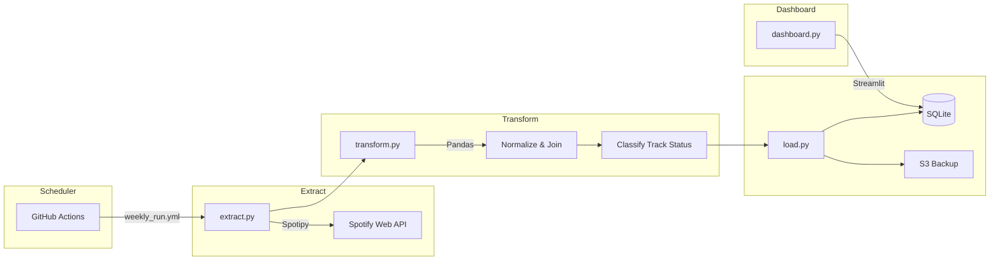
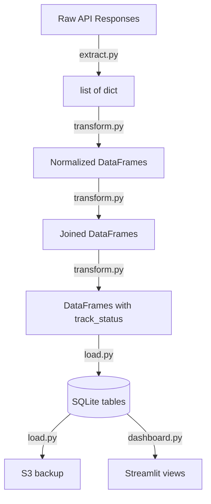

# Design Document: Spotify Global Trend Tracker

## Overview

The Spotify Global Trend Tracker is a Python-based ETL pipeline with an interactive dashboard. It extracts weekly chart data, audio features, and artist metadata from the Spotify Web API via Spotipy, transforms and enriches the data using Pandas, loads it into a local SQLite database, backs up to S3, and visualizes trends through a Streamlit dashboard. A GitHub Actions workflow automates the weekly cadence.

### Key Design Decisions

1. **Spotify Top 50 Playlists as Chart Source**: Spotify does not expose a dedicated "charts" API. Instead, the Extractor reads Spotify-curated "Top 50" playlists per region (e.g., `37i9dQZEVXbMDoHDwVN2tF` for Global). Playlist track order represents chart rank.

2. **Audio Features API Access**: As of November 2024, Spotify restricted the Audio Features endpoint for new apps ([source](https://developer.spotify.com/blog/2024-11-27-changes-to-the-web-api)). The design assumes the app has existing extended mode access. If unavailable, the pipeline gracefully degrades by storing null audio features and logging a warning.

3. **Client Credentials Flow**: The pipeline accesses only public data (playlists, tracks, artists). Client Credentials authentication via Spotipy is sufficient — no user OAuth flow is needed.

4. **SQLite for Simplicity**: SQLite provides zero-configuration local storage suitable for a single-writer weekly pipeline. Historical data accumulates in a single file, simplifying backup to S3.

5. **Upsert Strategy for Dimension Tables**: The `audio_features` and `artists` tables use INSERT OR REPLACE keyed on `track_id` and `artist_id` respectively, so the latest values are always stored. The `charts` table appends new rows partitioned by `(week, region)`.

6. **Pandas as Transformation Layer**: Pandas DataFrames serve as the in-memory representation between Extract and Load, providing natural join, merge, and comparison operations for the Transform stage.

## Architecture



### Pipeline Flow

1. **Scheduler** (GitHub Actions) triggers every Monday at 08:00 UTC
2. **Extract** — Spotipy fetches playlist tracks, audio features, and artist metadata
3. **Transform** — Pandas normalizes schemas, joins data, classifies track status
4. **Load** — SQLite receives transformed data; database file is uploaded to S3
5. **Dashboard** — Streamlit reads SQLite and renders interactive visualizations

### Module Responsibilities

| Module | Responsibility |
|---|---|
| `config.py` | Centralized configuration with env var overrides |
| `extract.py` | Spotify API calls via Spotipy; returns raw dicts |
| `transform.py` | Normalization, joins, track status classification |
| `load.py` | SQLite writes and S3 backup |
| `database.py` | SQLite connection management and schema creation |
| `dashboard.py` | Streamlit UI with filters and visualizations |

## Components and Interfaces

### config.py

```python
@dataclass
class Config:
    spotify_client_id: str
    spotify_client_secret: str
    s3_bucket: str
    s3_key_prefix: str
    regions: dict[str, str]  # region_name -> playlist_id
    db_path: str

def load_config() -> Config:
    """Load config from defaults, overridable via environment variables.
    Raises ValueError if required values are missing."""
```

The `regions` mapping connects region names to their Spotify Top 50 playlist IDs:
- Global: `37i9dQZEVXbMDoHDwVN2tF`
- US: `37i9dQZEVXbLRQDuF5jeBp`
- UK: `37i9dQZEVXbLnolsZ8PSNw`
- Japan: `37i9dQZEVXbKXQ4mDTEBXq`
- Brazil: `37i9dQZEVXbMXbN3EUUhlg`

### extract.py

```python
def extract_chart_data(sp: spotipy.Spotify, config: Config) -> list[dict]:
    """Fetch top 50 tracks for each region. Returns list of raw chart entry dicts.
    Raises ExtractionError on API failure for any region."""

def extract_audio_features(sp: spotipy.Spotify, track_ids: list[str]) -> list[dict]:
    """Fetch audio features for a batch of track IDs. Skips and logs failures per track.
    Returns list of audio feature dicts (may be shorter than input)."""

def extract_artist_metadata(sp: spotipy.Spotify, artist_ids: list[str]) -> list[dict]:
    """Fetch artist metadata for a batch of artist IDs. Skips and logs failures per artist.
    Returns list of artist metadata dicts (may be shorter than input)."""
```

### transform.py

```python
def normalize_chart_data(raw_charts: list[dict], week: str) -> pd.DataFrame:
    """Normalize raw chart entries into a DataFrame with columns:
    week, region, rank, track_id, track_name, artist_id.
    Assigns the given week timestamp to all records."""

def join_audio_features(charts_df: pd.DataFrame, features: list[dict]) -> pd.DataFrame:
    """Left-join chart data with audio features on track_id.
    Missing features result in null columns."""

def join_artist_metadata(charts_df: pd.DataFrame, artists: list[dict]) -> pd.DataFrame:
    """Left-join chart data with artist metadata on artist_id.
    Missing metadata results in null columns."""

def classify_track_status(
    current_df: pd.DataFrame,
    previous_weeks: pd.DataFrame
) -> pd.DataFrame:
    """Compare current week's chart entries against previous weeks for each region.
    Assigns track_status: 'new_entry', 'rising', 'returning', 'stable_or_falling'.
    Returns current_df with an added 'track_status' column."""
```

### load.py

```python
def load_to_sqlite(
    db_path: str,
    charts_df: pd.DataFrame,
    features_df: pd.DataFrame,
    artists_df: pd.DataFrame
) -> None:
    """Write DataFrames to SQLite tables within a transaction.
    Rolls back on error."""

def backup_to_s3(db_path: str, bucket: str, key_prefix: str, week: str) -> None:
    """Upload SQLite file to S3 with week in the key.
    Logs and continues on failure (does not halt pipeline)."""
```

### database.py

```python
def get_connection(db_path: str) -> sqlite3.Connection:
    """Return a connection to the SQLite database."""

def initialize_schema(conn: sqlite3.Connection) -> None:
    """Create tables if they don't exist."""

def get_previous_weeks_data(conn: sqlite3.Connection, region: str, n_weeks: int = 3) -> pd.DataFrame:
    """Retrieve chart data for the last n weeks for a given region.
    Used by track status classification."""
```

### dashboard.py

The Streamlit dashboard exposes four main views plus shared filters:

1. **Global vs Regional Chart Comparison** — Cross-market track overlap
2. **Audio Feature Breakdown** — Aggregated audio features for top tracks
3. **Artist Popularity Trends** — Time-series popularity lines
4. **Rising vs Falling Tracks** — Track status classification view

Shared sidebar filters: Region multi-select, date range picker, genre multi-select.

## Data Models

### SQLite Schema

```sql
CREATE TABLE IF NOT EXISTS charts (
    week TEXT NOT NULL,
    region TEXT NOT NULL,
    rank INTEGER NOT NULL,
    track_id TEXT NOT NULL,
    track_name TEXT NOT NULL,
    artist_id TEXT NOT NULL,
    track_status TEXT,
    PRIMARY KEY (week, region, track_id)
);

CREATE TABLE IF NOT EXISTS audio_features (
    track_id TEXT PRIMARY KEY,
    energy REAL,
    tempo REAL,
    danceability REAL,
    valence REAL,
    acousticness REAL,
    popularity INTEGER
);

CREATE TABLE IF NOT EXISTS artists (
    artist_id TEXT PRIMARY KEY,
    name TEXT NOT NULL,
    genres TEXT,          -- JSON-encoded list
    followers INTEGER,
    popularity INTEGER
);
```

### In-Memory Data Representations (Pandas DataFrames)

**Charts DataFrame** — columns: `week`, `region`, `rank`, `track_id`, `track_name`, `artist_id`, `track_status`

**Audio Features DataFrame** — columns: `track_id`, `energy`, `tempo`, `danceability`, `valence`, `acousticness`, `popularity`

**Artists DataFrame** — columns: `artist_id`, `name`, `genres`, `followers`, `popularity`

### Data Flow Between Stages



